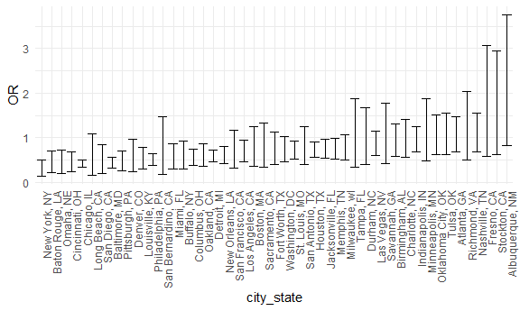
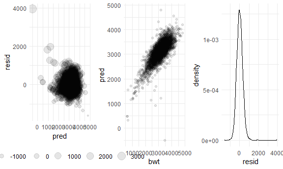
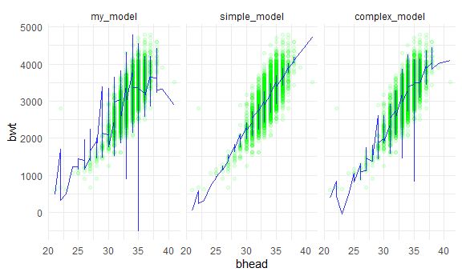
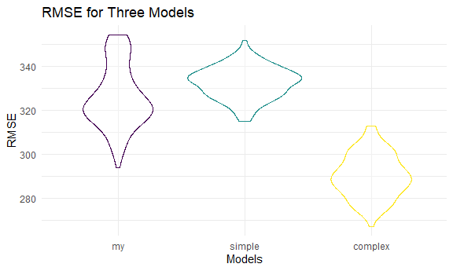
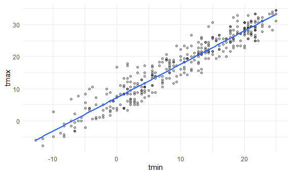
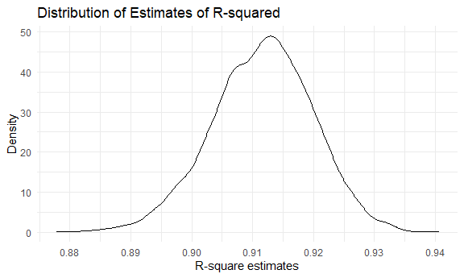
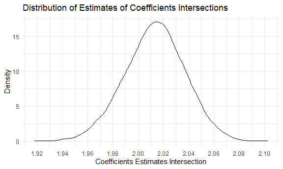

p8105\_hw6\_rw2844
================
Renjie Wei
11/24/2020

# Problem 1

``` r
homicide_df = 
  read_csv("homicide-data/homicide-data.csv", na = c("","NA","Unknown")) %>% 
  mutate(
    city_state = str_c(city, state, sep = ", "),
    victim_age = as.numeric(victim_age),
    resolved = case_when(
      disposition == "Closed without arrest" ~ 0,
      disposition == "Open/No arrest"        ~ 0,
      disposition == "Closed by arrest"      ~ 1
    )
  ) %>% 
  select(city_state, victim_age, victim_race, victim_sex,resolved) %>% 
  filter(
    victim_race %in% c("White","Black"),
    city_state != "Tulsa, AL")
```

    ## 
    ## -- Column specification --------------------------------------------------------
    ## cols(
    ##   uid = col_character(),
    ##   reported_date = col_double(),
    ##   victim_last = col_character(),
    ##   victim_first = col_character(),
    ##   victim_race = col_character(),
    ##   victim_age = col_double(),
    ##   victim_sex = col_character(),
    ##   city = col_character(),
    ##   state = col_character(),
    ##   lat = col_double(),
    ##   lon = col_double(),
    ##   disposition = col_character()
    ## )

Start with one sample city, Baltimore.

``` r
baltimore_df = 
  homicide_df %>% 
  filter(city_state == "Baltimore, MD")

glm(resolved ~ victim_age + victim_race + victim_sex,
    data = baltimore_df,
    family = binomial()) %>% 
  broom::tidy() %>% 
  mutate(
    OR = exp(estimate),
    CI_lower = exp(estimate - 1.96 * std.error),
    CI_upper = exp(estimate + 1.96 * std.error)
  ) %>% 
  select(term, OR, starts_with("CI")) %>% 
  knitr::kable(digits = 3)
```

| term              |    OR | CI\_lower | CI\_upper |
| :---------------- | ----: | --------: | --------: |
| (Intercept)       | 1.363 |     0.975 |     1.907 |
| victim\_age       | 0.993 |     0.987 |     1.000 |
| victim\_raceWhite | 2.320 |     1.648 |     3.268 |
| victim\_sexMale   | 0.426 |     0.325 |     0.558 |

``` r
models_results_df = 
  homicide_df %>% 
  nest(data = -city_state) %>% 
  mutate(
    models = 
      map(.x = data, ~glm(resolved ~ victim_age + victim_race + victim_sex, data = .x,family = binomial())),
    results = map(models, broom::tidy)
  ) %>% 
  select(city_state, results) %>% 
  unnest(results) %>% 
  mutate(
    OR = exp(estimate),
    CI_lower = exp(estimate - 1.96 * std.error),
    CI_upper = exp(estimate + 1.96 * std.error)
  ) %>% 
  select(city_state,term,OR,starts_with("CI"))
```

``` r
models_results_df %>% 
  filter(term == "victim_sexMale") %>% 
  mutate(
    city_state = fct_reorder(city_state, OR)
  ) %>% 
  ggplot(aes(x = city_state, y = OR))+
  geom_errorbar(aes(ymin = CI_lower, ymax = CI_upper))+
  theme(axis.text.x = element_text(angle = 90, hjust = 1))
```



# Problem 2

Read and clean the dataset.

``` r
baby_df = 
  read_csv("./data/birthweight.csv") %>% 
  mutate(
    babysex = case_when(babysex == 1~"male", babysex == 2~"female"),
    malform = case_when(malform == 0~"absent", malform == 1 ~ "present")
    ) %>% 
  mutate(
    across(
      .cols = c("frace", "mrace"),
      ~ case_when(
        .x == 1 ~ "White",
        .x == 2 ~ "Black",
        .x == 3 ~ "Asian",
        .x == 4 ~ "Puero Rican",
        .x == 8 ~ "Other",
        .x == 9 ~ "Unknown"
        )
      ),
    across(where(is.character), as.factor)
    ) 
```

    ## 
    ## -- Column specification --------------------------------------------------------
    ## cols(
    ##   .default = col_double()
    ## )
    ## i Use `spec()` for the full column specifications.

``` r
str(baby_df)
```

    ## tibble [4,342 x 20] (S3: spec_tbl_df/tbl_df/tbl/data.frame)
    ##  $ babysex : Factor w/ 2 levels "female","male": 1 2 1 2 1 2 1 1 2 2 ...
    ##  $ bhead   : num [1:4342] 34 34 36 34 34 33 33 33 36 33 ...
    ##  $ blength : num [1:4342] 51 48 50 52 52 52 46 49 52 50 ...
    ##  $ bwt     : num [1:4342] 3629 3062 3345 3062 3374 ...
    ##  $ delwt   : num [1:4342] 177 156 148 157 156 129 126 140 146 169 ...
    ##  $ fincome : num [1:4342] 35 65 85 55 5 55 96 5 85 75 ...
    ##  $ frace   : Factor w/ 5 levels "Asian","Black",..: 5 2 5 5 5 5 2 5 5 2 ...
    ##  $ gaweeks : num [1:4342] 39.9 25.9 39.9 40 41.6 ...
    ##  $ malform : Factor w/ 2 levels "absent","present": 1 1 1 1 1 1 1 1 1 1 ...
    ##  $ menarche: num [1:4342] 13 14 12 14 13 12 14 12 11 12 ...
    ##  $ mheight : num [1:4342] 63 65 64 64 66 66 72 62 61 64 ...
    ##  $ momage  : num [1:4342] 36 25 29 18 20 23 29 19 13 19 ...
    ##  $ mrace   : Factor w/ 4 levels "Asian","Black",..: 4 2 4 4 4 4 2 4 4 2 ...
    ##  $ parity  : num [1:4342] 3 0 0 0 0 0 0 0 0 0 ...
    ##  $ pnumlbw : num [1:4342] 0 0 0 0 0 0 0 0 0 0 ...
    ##  $ pnumsga : num [1:4342] 0 0 0 0 0 0 0 0 0 0 ...
    ##  $ ppbmi   : num [1:4342] 26.3 21.3 23.6 21.8 21 ...
    ##  $ ppwt    : num [1:4342] 148 128 137 127 130 115 105 119 105 145 ...
    ##  $ smoken  : num [1:4342] 0 0 1 10 1 0 0 0 0 4 ...
    ##  $ wtgain  : num [1:4342] 29 28 11 30 26 14 21 21 41 24 ...
    ##  - attr(*, "spec")=
    ##   .. cols(
    ##   ..   babysex = col_double(),
    ##   ..   bhead = col_double(),
    ##   ..   blength = col_double(),
    ##   ..   bwt = col_double(),
    ##   ..   delwt = col_double(),
    ##   ..   fincome = col_double(),
    ##   ..   frace = col_double(),
    ##   ..   gaweeks = col_double(),
    ##   ..   malform = col_double(),
    ##   ..   menarche = col_double(),
    ##   ..   mheight = col_double(),
    ##   ..   momage = col_double(),
    ##   ..   mrace = col_double(),
    ##   ..   parity = col_double(),
    ##   ..   pnumlbw = col_double(),
    ##   ..   pnumsga = col_double(),
    ##   ..   ppbmi = col_double(),
    ##   ..   ppwt = col_double(),
    ##   ..   smoken = col_double(),
    ##   ..   wtgain = col_double()
    ##   .. )

``` r
# sum(is.na(baby_df)) = 0
```

Build a regression model for birthweight.

Let’s try to regress birthweight on
`babysex`,`blength`,`gaweeks`,`momage`,`parity`,`ppwt`,`wtgain`and
`smoken`.

``` r
proposal_model = 
  lm(bwt ~ babysex + blength + gaweeks + momage + parity + ppwt + wtgain + smoken, data = baby_df)

proposal_model %>% broom::tidy() %>% knitr::kable(digits = 3)
```

| term        |  estimate | std.error | statistic | p.value |
| :---------- | --------: | --------: | --------: | ------: |
| (Intercept) | \-4453.02 |    98.318 |   \-45.29 |   0.000 |
| babysexmale |     18.13 |     9.937 |      1.82 |   0.068 |
| blength     |    121.09 |     2.007 |     60.34 |   0.000 |
| gaweeks     |     25.26 |     1.699 |     14.87 |   0.000 |
| momage      |      9.00 |     1.302 |      6.91 |   0.000 |
| parity      |    105.25 |    48.100 |      2.19 |   0.029 |
| ppwt        |      2.04 |     0.250 |      8.16 |   0.000 |
| wtgain      |      5.32 |     0.466 |     11.42 |   0.000 |
| smoken      |    \-3.51 |     0.671 |    \-5.23 |   0.000 |

Plot of residuals verses fitted values

``` r
proposal_plt =
  baby_df %>% 
  add_predictions(proposal_model) %>%
  add_residuals(proposal_model) 

pred_plt1 = 
  proposal_plt %>% 
  ggplot(aes(x = pred, y = resid)) +
  geom_point(aes(size = resid), alpha = .1)

pred_plt2 = 
  proposal_plt %>% 
  ggplot(aes(x = bwt, y = pred)) +
  geom_point(alpha = .1)

pred_plt3 = 
  proposal_plt %>% 
  ggplot(aes(x = resid))+
  geom_density()

plot_grid(pred_plt1,pred_plt2,pred_plt3, ncol = 3)
```



**Comments:**

  - Residuals seems to be larger when the predict value is low.

  - The model fits well when birthweigth lies between 2000 grams to 4000
    grams.

  - The distribution of residuals are approximately normal (with a long
    tail).

Let’s do the model comparison.

``` r
# Take a look at the regressions first
my_model = lm(bwt ~ babysex + blength + gaweeks + momage + parity + ppwt + wtgain + smoken, data = baby_df)
simple_model = lm(bwt ~ bhead + gaweeks, data = baby_df)
complex_model = lm(bwt ~ bhead*blength*babysex, data = baby_df)

baby_df %>% 
  gather_predictions(my_model, simple_model, complex_model) %>% 
  mutate(model = fct_inorder(model)) %>% 
  ggplot(aes(x = bhead, y = bwt)) + 
  geom_point(alpha = .1, color = "green" ) + 
  geom_line(aes(y = pred), color = "blue", alpha = .8) + 
  facet_wrap(~model)
```



``` r
baby_cv = 
  crossv_mc(baby_df, 100) %>% 
  mutate(
    my_model = map(train,  ~lm(bwt ~ babysex + blength + gaweeks + momage + parity + ppwt + wtgain + smoken, data = .x)),
    simple_model = map(train, ~lm(bwt ~ bhead + gaweeks, data = .x)),
    complex_model = map(train, ~lm(bwt ~ bhead*blength*babysex, data = .x)),
    rmse_my = map2_dbl(my_model, test, ~rmse(model = .x, data = .y)),
    rmse_simple = map2_dbl(simple_model, test, ~rmse(model = .x, data = .y)),
    rmse_complex = map2_dbl(complex_model, test, ~rmse(model = .x, data = .y))
  )

baby_cv_tidy = 
  baby_cv %>% 
  select(starts_with("rmse")) %>% 
  pivot_longer(
    everything(),
    names_to = "model",
    values_to = "rmse",
    names_prefix = "rmse_"
  ) %>% 
  mutate(model = fct_inorder(model))
  

baby_cv_tidy %>% 
  ggplot(aes(x = model, y = rmse, group = model, color = model)) +
  geom_violin(alpha = .3) +
  theme(legend.position = "none") +
  labs(
    title = "RMSE for Three Models",
    x = "Models",
    y = "RMSE"
  )
```



We got the crossvalidation results from above.

# Problem 3

Import the data.

And take a look of the regression.

``` r
weather_df %>%
  ggplot(aes(x = tmin, y = tmax)) +
  geom_point(alpha = .3) +
  geom_smooth(method = "lm",se = F)
```

    ## `geom_smooth()` using formula 'y ~ x'



Let’s bootstraping

``` r
weather_boot = 
  weather_df %>% 
  bootstrap(n = 5000) %>%
  mutate(
    models = map(strap, ~lm(tmax ~ tmin, data = .x)),
    results = map(models, broom::tidy),
    glanced = map(models, broom::glance)
    ) %>% 
  select(-strap, -models) %>% 
  unnest(c(results, glanced), names_repair = "unique") %>% 
  select(.id, term, estimate, r.squared) %>% 
  mutate(
    term = str_replace(term, "\\(Intercept\\)", "intercept")
  ) %>% 
  pivot_wider(
    names_from = term,
    values_from = estimate
  ) %>% 
  mutate(
    intersection = log(intercept * tmin),
    .id = as.numeric(.id)
  ) %>% 
  select(-intercept, -tmin)
```

    ## New names:
    ## * statistic -> statistic...5
    ## * p.value -> p.value...6
    ## * statistic -> statistic...10
    ## * p.value -> p.value...11

Let’s plot the distribution of rsquare.

``` r
weather_boot %>% 
  ggplot(aes(x = r.squared)) +
  geom_density() +
  labs(
    title = "Distribution of Estimates of R-squared",
    x = "R-square estimates",
    y = "Density"
  ) +
  scale_x_continuous(
    breaks = seq(.85,.95,.01)
  )
```



**Comments:**

The distribution of estimated r-squared is approximately normal. With
the mean 0.912 and median 0.912. And the standard error of this
distribution is 0.008. Ranging from 0.878 to 0.941.

Let’s plot the intersection

``` r
weather_boot %>% 
  ggplot(aes(x = intersection)) +
  geom_density() +
  labs(
    title = "Distribution of Estimates of Coefficients Intersections",
    x = "Coefficients Estimates Intersection",
    y = "Density"
  ) +
  scale_x_continuous(
    breaks = seq(1.90, 2.15, .02)
  )
```



**Comments:**

The distribution of the natural log of the intersection of estimated
coefficients is approximately normal. With the mean 2.013 and median
2.014. And the standard error of this distribution is 0.024. Ranging
from 1.918 to 2.103.
